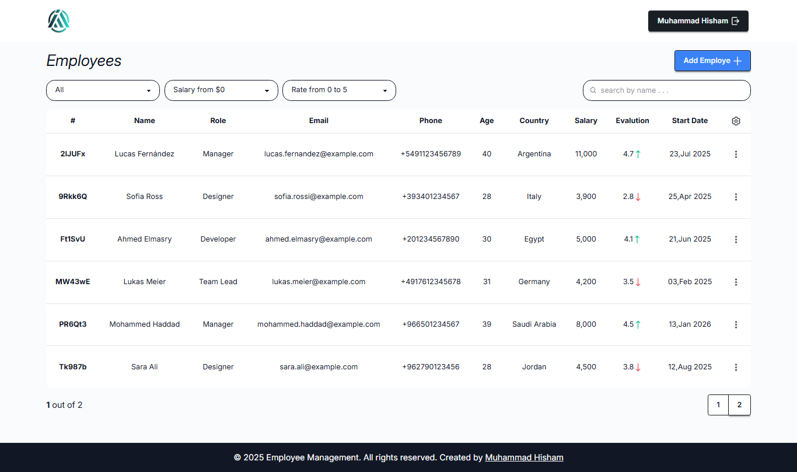

# Employee Management CRUD App


A professional employee management application with authentication and CRUD operations built with Firebase and React.

## Features

- 🔒 **Secure Authentication** using Firebase Auth
- 👥 **Employee CRUD Operations** (Create, Read, Update, Delete)
- ⚡ **Blazing Fast Performance** with Vite
- 🔄 **Real-time Data** with Firestore
- 🏗️ **Optimized State Management** with TanStack Query
- 📝 **Efficient Forms** using React Hook Form
- 🖥️ **Responsive UI** works on all devices

## Pages & Components

| Page/Component | Description |
|---------------|-------------|
| **Signup Page** | New user registration with email/password validation |
| **Login Page** | Secure authentication with email/password |
| **Home Page** | Dashboard displaying all employees |
| **Employe page** | Detailed view of individual employee with full profile information |
| **Add Modal** | Form to create new employee records |
| **Edit Modal** | Form to update existing employees |
| **Delete Modal** | Confirmation dialog for deletion |

## Tech Stack

**Frontend:**

- React.js
- Vite (Build tool)
- TanStack Query (v4+)

**Backend Services:**

- Firebase Authentication
- Firestore Database

**UI & Forms:**

- React Hook Form
- (Tailwind CSS, daisyUI)

## Screenshots



## 🚀 Live Preview

Check out the live version here: [Employees managment](https://employees-management-6wvd.vercel.app/)

## 📂 Folder Structure

```crud-app/
├── frontend/
│   ├── node_modules
│   ├── public
│   ├── src/
│   │   ├── assets
│   │   ├── components
│   │   ├── hooks
│   │   ├── layouts
│   │   ├── pages
│   │   ├── services
│   │   ├── utils
│   │   ├── App.css
│   │   ├── App.jsx
│   │   ├── index.css
│   │   └── main.jsx
│   ├── index.html
│   ├── package.json
│   ├── package-lock.json
│   ├── eslint.config.js
│   ├── vite.config.js
│   └── .gitignore
└── README.md
```

## Installation

1. Clone the repository:

```bash
git clone https://github.com/mohamedhesham221/employees-management
cd crud-app/frontend
```

## 🔥 Firebase Configuration

### 1. Firebase Project Setup

1. Go to [Firebase Console](https://console.firebase.google.com/)
2. Click "Add Project" and follow the setup wizard
3. Enable these services:

### 2. Authentication Setup

```bash
# Enable Email/Password auth:
1. Go to Authentication → Sign-in method
2. Click "Email/Password" and enable it
3. Save changes
```

### Initialize Firestore

1. Go to Firestore Database
2. Click "Create Database" → Start in test mode
3. Choose your preferred region
4. Click "Enable"

### Environment Variables

- Create .env file in project root:

```bash
VITE_FIREBASE_API_KEY=<API_KEY>
VITE_FIREBASE_AUTH_DOMAIN=<AUTH_DOMAIN>
VITE_FIREBASE_PROJECT_ID=<PROJECT_ID>
VITE_FIREBASE_STORAGE_BUCKET=<STORAGE_BUCKET>
VITE_FIREBASE_MESSAGING_SENDER_ID=<MESSAGING_SENDER_ID>
VITE_FIREBASE_APP_ID=<APP_ID>
```

## 👨‍💻 Author

[](https://www.linkedin.com/in/muhammad-hisham-23544b253/)
[](mailto:muhammedheshamm2@gmail.com)
